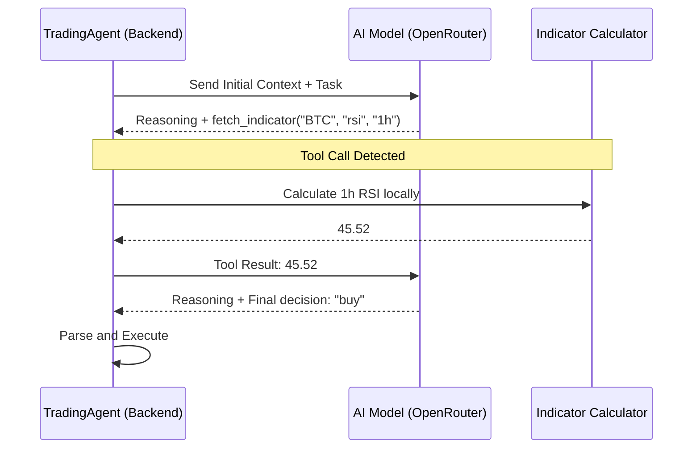

# Decision Agent

The Decision Agent (`src/agent/`) is the cognitive center of Rez. It orchestrates the flow between raw technical data and final trade execution using Large Language Models (LLMs).

## The `TradingAgent` Architecture

The `TradingAgent` class encapsulates the logic for prompt construction, LLM interaction, and tool-calling orchestration.

### Initial Context Construction
When a decision is requested, the agent assembles a comprehensive context payload:
*   **Account Context**: Total value, current leverage, and available cash.
*   **Position Context**: Entry price, current PnL, and liquidation price of open trades.
*   **Market Context**: A snapshots of indicators (EMA, RSI, MACD, Volume) for the assets being considered.

### The ReAct Cycle Sequence

The interaction follows a strict multi-turn sequence to ensure the model has all necessary data before deciding.



## Output Formatting & Contract

To ensure the backend can reliably execute LLM decisions, Rez uses **Structured Outputs**.

### JSON Schema Enforcement
The agent requests data in a strict JSON format:
```json
{
  "reasoning": "...",
  "summary": "Short bullish thesis...",
  "trade_decisions": [
    {
      "asset": "BTC",
      "action": "buy",
      "percentage": 50,
      "leverage": 5,
      "tp_price": 68000,
      "sl_price": 64000
    }
  ]
}
```

### Sanitization Fallback
If the primary model (e.g., GPT-4o) provides malformed JSON, the agent triggers a secondary **Sanitizer Loop**. A smaller model (`gpt-4o-mini`) is used to "clean" the raw response into the valid schema without altering the trade intent.

## Model Flexibility
Thanks to the OpenRouter integration, the Decision Agent can be configured to use any state-of-the-art model (DeepSeek, Grok, Claude, GPT-4) simply by updating the `config.json`.
